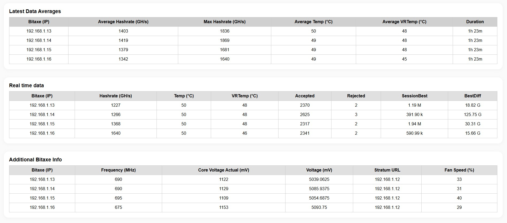
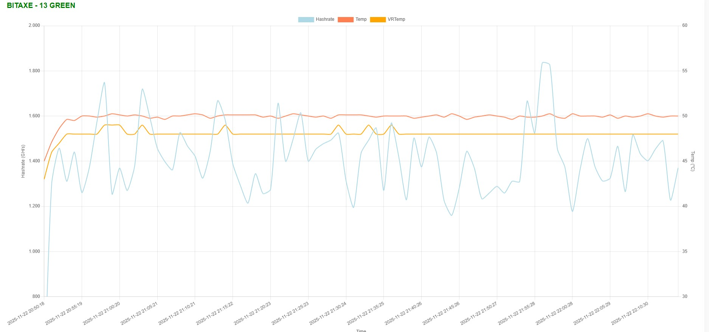

🚀 DASHBOARD-BITAXE-601

A modern, multi-unit dashboard for monitoring Bitaxe 601 miners with real-time data, session analytics, temperature monitoring, CKPool support, Telegram alerts and full compatibility with Tailscale for secure remote access.

Supports up to 4 Bitaxe units (Gamma / Ultra / DIY).
No database required. Fully standalone Flask backend.

⭐ Features
📡 Real-time Bitaxe Telemetry

Hashrate (GH/s)

Temperature (°C)

VR Temperature (°C)

Voltage & Core Voltage

Frequency (MHz)

Fan speed

Shares accepted / rejected

Stratum URL

Per-unit SessionBest + BestDiff

📊 Analytics & Charts

Real-time charts (hashrate + temps)

Averages calculated over the entire log session

SessionBest historical line chart

Combined multi-metric charts for each Bitaxe

🧰 Extra Tools

One-click restart per Bitaxe

Automatic system restart every X hours

Automatic log rotation

CKPool log live parsing (optional)

Fully Tailscale-ready (0.0.0.0 binding)

Telegram alerts:

High temperature

SessionBest improvement

📦 Requirements

Python 3.9+

Flask

requests

Chart.js (loaded via CDN)

Bitaxe units on LAN or Tailscale

Optional: CKPool running locally

Install Python dependencies:

pip install flask requests

🗂️ Project Structure
DASHBOARD-BITAXE-601/
│
├── dashboard_request.py       # Main Flask backend
├── templates/
│   └── index.html             # Dashboard UI
├── static/
│   └── favicon.ico            # UI icon
├── screenshot data.jpg        # Screenshots
├── screenshot real-time chart section.jpg
├── screenshot sessionbest chart .jpg
├── README.md
├── LICENSE
└── .gitignore

⚙️ Configuration (inside dashboard_request.py)

Edit the IP list for your Bitaxe units (Tailscale-friendly):

BITAXE_IPS = [
    "100.100.100.1",
    "100.100.100.2",
    "100.100.100.3",
    "100.100.100.4",
]

Other optional parameters:

LOGFILE = "bitaxe_log.txt"
CKPOOL_LOG = "ckpool.log"
DASHBOARD_PORT = 19150

COLLECT_INTERVAL = 60
TEMP_ALERT = 60
BITAXE_RESTART_EVERY_HOURS = 24

🔔 Telegram Alerts via environment variables
export TG_TOKEN="your_bot_token"
export TG_CHAT_ID="your_chat_id"

On Windows PowerShell:

setx TG_TOKEN "your_bot_token"
setx TG_CHAT_ID "your_chat_id"

If the variables are missing, Telegram alerts are automatically disabled.

🌍 Remote Access via Tailscale

The dashboard binds to:

http://0.0.0.0:19150

➡️ This means you can access it from ANY Tailscale device:

http://<TAILSCALE-IP>:19150

Bitaxe units must also be reachable via LAN or Tailscale.

⛏️ Mining Modes
1. CKPool Solo Mining

If ckpool.log is present, the dashboard automatically parses it and displays mining stats.

2. External Pool Mining

Dashboard works fully without CKPool:

real-time telemetry

session bests

charts

averages

🖥️ Running the Dashboard
python dashboard_request.py

Then open:

http://localhost:19150

Or via Tailscale:

http://<TAILSCALE-IP>:19150

📸 Screenshots
Averages Panel

Real-Time Charts

SessionBest Chart

🛠️ Optional: systemd Service (Linux)
/etc/systemd/system/bitaxe-dashboard.service

[Unit]
Description=Bitaxe Dashboard
After=network.target

[Service]
User=pi
WorkingDirectory=/home/pi/DASHBOARD-BITAXE-601
ExecStart=/usr/bin/python3 dashboard_request.py
Restart=always
Environment=TG_TOKEN=your_token
Environment=TG_CHAT_ID=your_chat_id

[Install]
WantedBy=multi-user.target

Enable it:

sudo systemctl daemon-reload
sudo systemctl enable bitaxe-dashboard
sudo systemctl start bitaxe-dashboard

🤝 Contributing

Pull Requests welcome:

UI / CSS improvements

Additional metrics

CKPool enhancements

Bitaxe Ultra support

Multi-pool integration

📄 License

Released under the MIT License.
